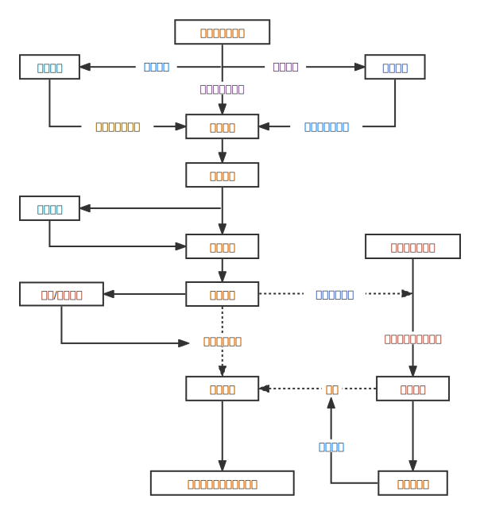
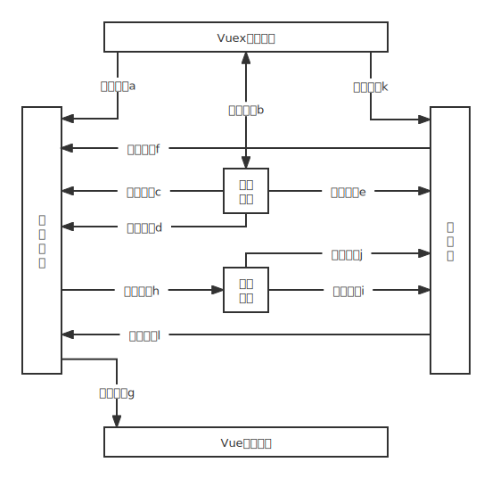
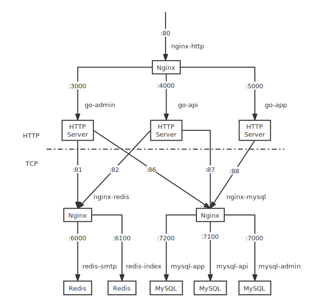
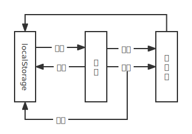

# TOEFL Exam APP

### Introduction

Follow the video to get general using method.

And the whole process is as following shows:

Two improvements against other TOEFL practice platform:

* search for texts under specific topics via search engine through key words
* self-defined exams

Note: The server was deployed on 106.12.17.34, located in Suzhou, Jiangsu, China, has been expired on June 6th, 2022.

### Data obtain && Search Engine

All exam data scrawled from [xdf](https://liuxue.koolearn.com/toefl/), [zhan](https://top.zhan.com/toefl/), [kmf](https://toefl.kmf.com/)

Thus, I have the most latest and integrated TOEFL exam data.

I use scrapy to deploy spiders, implementing a middleware using selenium to simulate the behavior of a web browser to cheat the anti-bot monitor of the website. Because simulating web browser needs to execute all the scripts related instead of focusing on a typical element in the web page, generally, the crawling speed is low. I use multi-thread to concurrently obtain and filter data.

All data scrawled contains 195 reading passages, 379 listening items, 260 speaking topics, 130 writing sections and over 2GB listening audio materials.

Search engine is self implemented.

Get tokens from data and generate inverted list.

Data stored in MySQL with JSON format and key-value of inverted list stored in Redis with Set data structure.

### Front-end and client

using electron + vue + vuex

the architecture of front-end and client is as the image shows:

electron based on node.js, interacting with local operating system, vue is used to developement as components in order to binding UI and data, vuex is of great help to interact between different components and temporarily record some data in case of flushing due to page routing change.

### Back-end

Dockerization (compile and deploy), micro-service style, seperate each other, high concurrency and high availability, easy to transfer and maintain

the architecture of back-end is as follows:

### Other stratergies

recover of paper sheet.

Use local storage to store the current info, when cover is needed, read it out and confirm it with server. As the following shows:

This method is better than sending updated info to the server and recording them in the database everytime. Because it wastes too much time.(even though using websocket)
